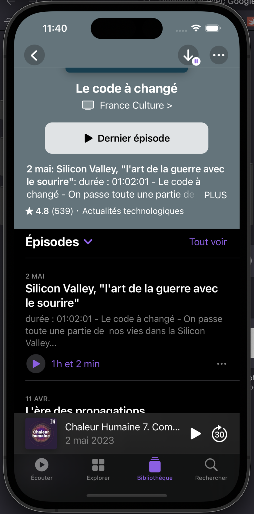

<h1 align="center">🎙️ SwiftCast 🎙️</h1>

The goal of SwiftCast is to propose an iOS mobile application very similar to the Apple Podcast application.

## ✔️ Features

- [x] Browse podcasts sorted by the last update date.
- [x] See the detail for each podcast (image, title, author, rating, reviews, episodes...)
- [x] Visuals identical to the originals !
- [x] Support for various themes (light / dark) and responsive screen.

## 📱 Application

Here you can see the actual visual of the application 

    
    
    

    
    
    

    
    
    
    

    <i>
        As you can see, the visuals are really consistent with those of the original application, both in blur effects, in shapes, colors and layout. It makes you want to finish the app!
    </i>

## 🖥️ Langages and technologies used

- Swift ([API reference](https://www.swift.org/))
- SwiftUI ([API reference](https://developer.apple.com/documentation/swiftui))

## 🧵 Prerequisities

- [XCode](https://apps.apple.com/fr/app/xcode/id497799835?mt=12)

## ⚙️ How to run the app ?

1. Start XCode.
2. Open the workspace named `SwiftCast.xcworkspace` in `Sources/`.
3. Start an emulator or open the preview (`command` + `option` + `Enter`) for a file (example: `SwiftCast/Views/MainView`) to browse the app.

## 📌 Documentation

The [Wiki]("https://codefirst.iut.uca.fr/git/jeremy.tremblay/SwiftCast/wiki") is actually empty. The documantion will be added soon!

Also, look at the `Documentation` folder at the root of this repository!

## 👤 Author

**TREMBLAY Jérémy**

* Github: [@JeremyTremblay2](https://github.com/JeremyTremblay2)
* LinkedIn: [@Jérémy Tremlay](https://fr.linkedin.com/in/j%C3%A9r%C3%A9my-tremblay2)

## 📝 License

I want to leave the possibility to other people to work on this project, to improve it and to make it grow, that's why we decided to place it under MIT license.

> Read more about the [MIT licence](https://opensource.org/licenses/MIT).